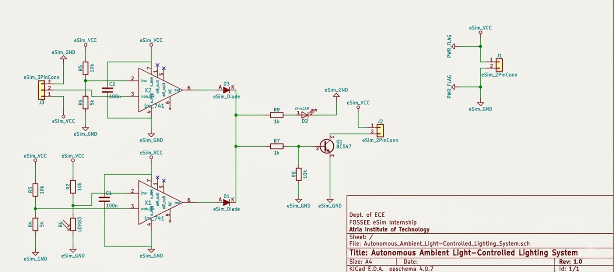
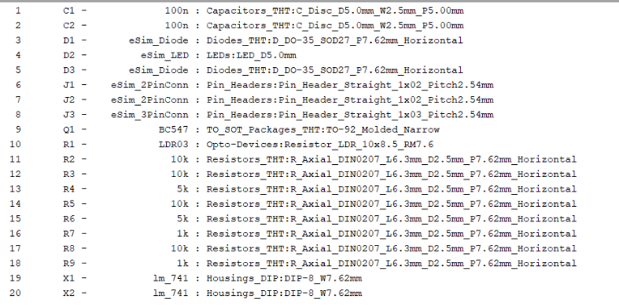
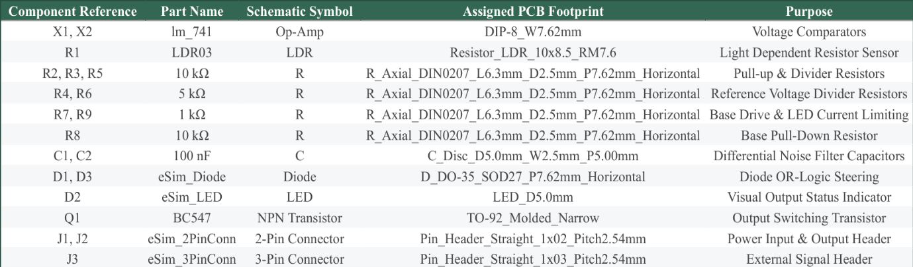
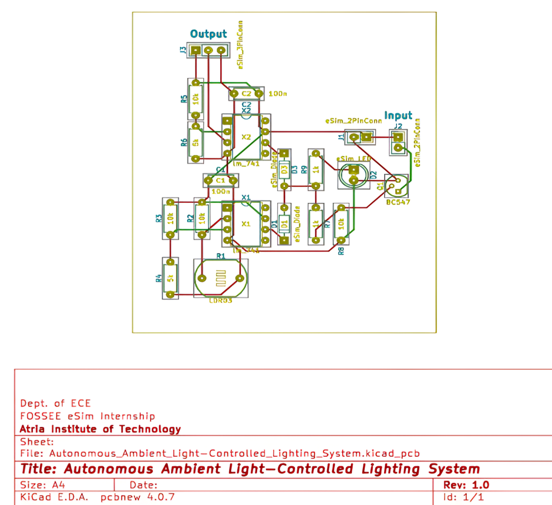
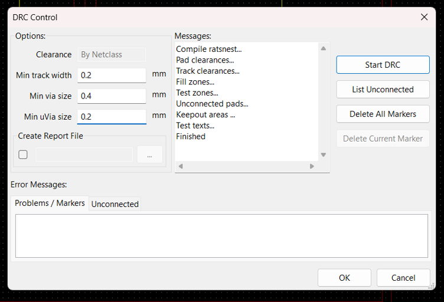
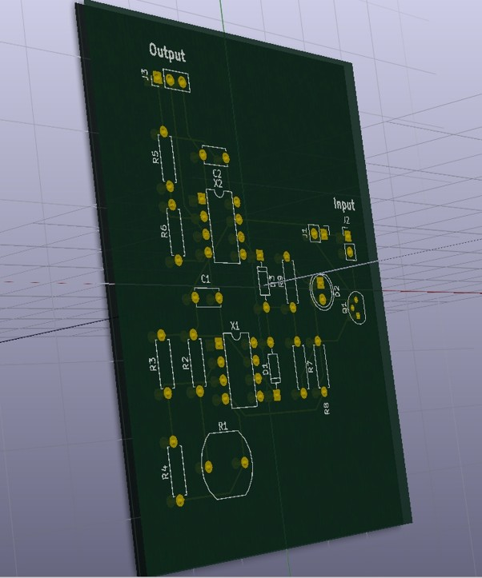
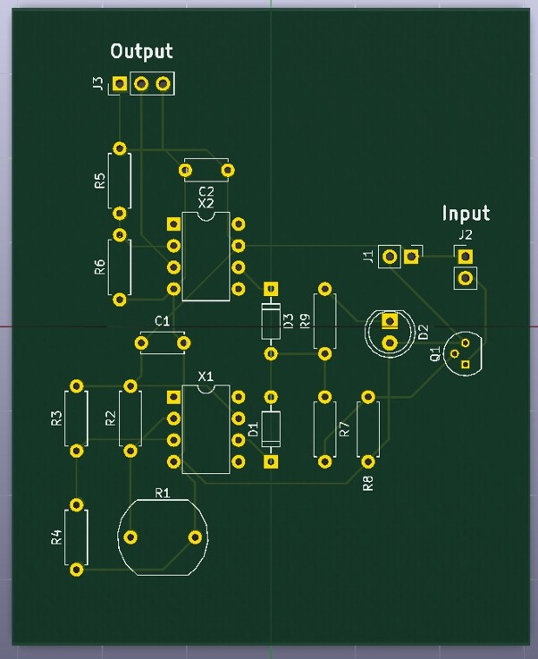

<div align="center">
  

  # eSim Semester Long Internship - Autumn 2026
</div>

**Project Title:** Autonomous Ambient Light-Controlled Lighting System  
**Software Used:** eSim v2.3  
**Layer Count:** 4-Layer Printed Circuit Board (F.Cu, In1.Cu, In2.Cu, B.Cu)  

**Submitted by,**  
Milind A Bhandwalker  
Department of Electronics and Communication  
Atria Institute of Technology  

---

## Contents
- [Project Overview](#project-overview)
- [Circuit Description](#circuit-description)
- [Schematic](#schematic)
- [Footprint Assignment](#footprint-assignment)
- [PCB Layout](#pcb-layout)
- [Routing Methodology](#routing-methodology)
- [DRC Results](#drc-results)
- [3D View](#3d-view)
- [Design Considerations & Conclusion](#design-considerations--conclusion)

---

## Project Overview
An Autonomous Ambient Light-Controlled Lighting System is an automated lighting management circuit designed to switch an output load based on ambient light conditions. Using an LDR light-sensor network alongside dual LM741 operational amplifiers, the system compares ambient light levels against pre-set threshold voltages to trigger switching transistors and status indicators.

---

## Circuit Description
The circuit consists of five primary functional stages based on the schematic:

* **Power Entry Stage (J1 & Power Flags):** Main power supply input is connected via 2-pin connector J1 (`eSim_2PinConn`). Global power supply rails are defined by net flags `eSim_VCC` (Pin 1) and `eSim_GND` (Pin 2).
* **Sensor & Reference Voltage Stage (X1 Op-Amp Inputs):**
  * **LDR Sensor Input:** Resistor R2 (10 kΩ) and Light Dependent Resistor R1 (LDR03) form a voltage divider connected to non-inverting terminal Pin 3 of operational amplifier X1 (`lm_741`).
  * **Reference Threshold:** Resistors R3 (10 kΩ) and R4 (5 kΩ) form a fixed reference voltage divider connected to inverting terminal Pin 2 of X1.
  * **Filtering:** Ceramic capacitor C1 (100 nF) is connected across pins 2 and 3 of X1 to suppress high-frequency noise.
* **Auxiliary Signal Stage (X2 Op-Amp Inputs):**
  * **Fixed Reference:** Resistors R5 (10 kΩ) and R6 (5 kΩ) form a fixed reference voltage divider connected to inverting terminal Pin 2 of X2.
  * **External Input Terminal J3:** 3-pin connector J3 (`eSim_3PinConn`) connects directly to non-inverting terminal Pin 3 of X2.
  * **Filtering:** Capacitor C2 (100 nF) filters high-frequency noise across pins 2 and 3 of X2.
* **Diode-OR Logic Stage (D1, D3):** Outputs (Pin 6) of both op-amps drive steering diodes D1 and D3 (`eSim_Diode`), implementing OR logic to allow either comparator output to trigger the switching stage.
* **Output Switching Stage (Q1, D2, J2):**
  * **Transistor Driver:** The combined diode output connects through resistor R7 (1 kΩ) and pull-down resistor R8 (10 kΩ) to the base of NPN transistor Q1 (BC547), which controls the load connected across 2-pin terminal J2.
  * **Visual Indicator:** Current-limiting resistor R9 (1 kΩ) drives status LED D2 (`eSim_LED`) for output visual confirmation.

---

## Schematic


---

## Footprint Assignment


```text
1   C1  100n        Capacitors_THT:C_Disc_D5.0mm_W2.5mm_P5.00mm
2   C2  100n        Capacitors_THT:C_Disc_D5.0mm_W2.5mm_P5.00mm
3   D1  eSim_Diode  Diodes_THT:D_DO-35_SOD27_P7.62mm_Horizontal
4   D2  eSim_LED    LEDs:LED_D5.0mm
5   D3  eSim_Diode  Diodes_THT:D_DO-35_SOD27_P7.62mm_Horizontal
6   J1  eSim_2PinConn   Pin_Headers:Pin_Header_Straight_1x02_Pitch2.54mm
7   J2  eSim_2PinConn   Pin_Headers:Pin_Header_Straight_1x02_Pitch2.54mm
8   J3  eSim_3PinConn   Pin_Headers:Pin_Header_Straight_1x03_Pitch2.54mm
9   Q1  BC547       TO_SOT_Packages_THT:TO-92_Molded_Narrow
10  R1  LDR03       Opto-Devices:Resistor_LDR_10x8.5_RM7.6
11  R2  10k         Resistors_THT:R_Axial_DIN0207_L6.3mm_D2.5mm_P7.62mm_Horizontal
12  R3  10k         Resistors_THT:R_Axial_DIN0207_L6.3mm_D2.5mm_P7.62mm_Horizontal
13  R4  5k          Resistors_THT:R_Axial_DIN0207_L6.3mm_D2.5mm_P7.62mm_Horizontal
14  R5  10k         Resistors_THT:R_Axial_DIN0207_L6.3mm_D2.5mm_P7.62mm_Horizontal
15  R6  5k          Resistors_THT:R_Axial_DIN0207_L6.3mm_D2.5mm_P7.62mm_Horizontal
16  R7  1k          Resistors_THT:R_Axial_DIN0207_L6.3mm_D2.5mm_P7.62mm_Horizontal
17  R8  10k         Resistors_THT:R_Axial_DIN0207_L6.3mm_D2.5mm_P7.62mm_Horizontal
18  R9  1k          Resistors_THT:R_Axial_DIN0207_L6.3mm_D2.5mm_P7.62mm_Horizontal
19  X1  lm_741      Housings_DIP:DIP-8_W7.62mm
20  X2  lm_741      Housings_DIP:DIP-8_W7.62mm
```

### Component Reference

| Component Reference | Part Name | Schematic Symbol | Assigned PCB Footprint | Purpose |
| :--- | :--- | :--- | :--- | :--- |
| X1, X2 | lm_741 | Op-Amp | DIP8_W7.62mm | Voltage Comparators |
| R1 | LDR03 | LDR | Resistor_LDR_10x8.5_RM7.6 | Light Dependent Resistor Sensor |
| R2, R3, R5 | 10 kΩ | R | R_Axial_DIN0207_L6.3mm_D2.5mm_P7.62mm_Horizontal | Pull-up & Divider Resistors |
| R4, R6 | 5 kΩ | R | R_Axial_DIN0207_L6.3mm_D2.5mm_P7.62mm_Horizontal | Reference Voltage Divider Resistors |
| R7, R9 | 1 kΩ | R | R_Axial_DIN0207_L6.3mm_D2.5mm_P7.62mm_Horizontal | Base Drive & LED Current Limiting |
| R8 | 10 kΩ | R | R_Axial_DIN0207_L6.3mm_D2.5mm_P7.62mm_Horizontal | Base Pull-Down Resistor |
| C1, C2 | 100 nF | C | C_Disc_D5.0mm_W2.5mm_P5.00mm | Differential Noise Filter Capacitors |
| D1, D3 | eSim_Diode | Diode | D_DO-35_SOD27_P7.62mm_Horizontal | Diode OR-Logic Steering |
| D2 | eSim_LED | LED | LED_D5.0mm | Visual Output Status Indicator |
| Q1 | BC547 | NPN Transistor | TO-92_Molded_Narrow | Output Switching Transistor |
| J1, J2 | eSim_2PinConn | 2-Pin Connector | Pin_Header_Straight_1x02_Pitch2.54mm | Power Input & Output Header |
| J3 | eSim_3PinConn | 3-Pin Connector | Pin_Header_Straight_1x03_Pitch2.54mm | External Signal Header |

---

## PCB Layout


---

## Routing Methodology
To ensure high signal integrity, minimal interference, and proper voltage distribution, a 4-layer PCB stackup strategy was implemented:

**Layer Stackup Configuration:**
* **F.Cu (Top Layer):** Dedicated to primary component interconnects and signal trace routing.
* **In1.Cu (Inner Layer 1):** Solid ground plane (`eSim_GND`) pour to minimize loop inductance and provide EMI shielding.
* **In2.Cu (Inner Layer 2):** Solid power plane (`eSim_VCC`) pour to maintain low-impedance power delivery across all IC pins.
* **B.Cu (Bottom Layer):** Used for auxiliary signal routing and ground return copper fills.

**Silkscreen Identification:** Clear silkscreen labels (Input near connector J2 and Output near connector J3) were placed on the front silkscreen layer (F.SilkS) for ease of physical identification.

---

## DRC Results
A complete Design Rule Check (DRC) was performed in Pcbnew to ensure zero manufacturing violations:

* **Unconnected Nets:** 0 (links 36, nc 0, net 7: not conn 0)
* **Clearance Violations:** 0
* **Short Circuits:** 0



---

## 3D View

### Isometric View
  
*Fig: 3D isometric perspective view showing PCB substrate, board thickness, through-hole drill pads, and surface routing.*

### Top View
  
*Fig: 3D top view showing silkscreen footprints, text labels, and component pad locations.*

### Bottom View
  
*Fig: 3D bottom view showing bottom copper trace routing and terminal pads.*

---

## Design Considerations & Conclusion

**Superior Noise Mitigation:** A dedicated 4-layer stackup with continuous internal Ground (In1.Cu) and Power (In2.Cu) planes drastically lowers loop inductance and eliminates supply ripple. Decoupling capacitors (C1, C2) placed directly at the op-amp supply pins (X1, X2) ensure pristine signal integrity and robust EMI suppression.

**Prototyping & Assembly Readiness:** Footprints and silkscreen legends conform strictly to standard IPC tolerances. Highly visible reference designators (R1-R9, D1-D3, Q1, J1-J3) and explicit functional callouts (Input, Output) enable error-free manual soldering and automated assembly.

**Manufacturing Compliance:** Design Rule Checking (DRC) verifies zero errors and zero unconnected items. Trace widths, pad clearances, and board outline dimensions meet all standard fabrication requirements, making the layout fully validated for Gerber file export.

The Autonomous Ambient Light-Controlled Lighting System PCB design is fully optimized and production-ready. Integrating multi-layer power distribution, signal isolation, and thermal/trace routing into a verified layout ensures 100% compliance with FOSSEE standards and physical fabrication readiness.
